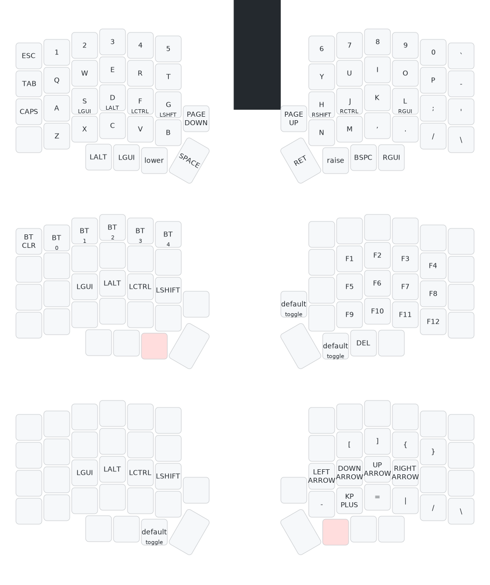

# Self-Contained ZMK Firmware Builds

Under construction.

Slapped together on top of nix shell via zmk firmware/zephyr official docs.

zmk pulled in as a git subtree from https://github.com/zmkfirmware/zmk

zephyr sdk installed via [official docs](https://docs.zephyrproject.org/3.2.0/develop/getting_started/index.html#install-zephyr-sdk) (sans udev rules).

    wget https://github.com/zephyrproject-rtos/sdk-ng/releases/download/v0.16.3/zephyr-sdk-0.16.3_linux-x86_64.tar.xz
    wget -O - https://github.com/zephyrproject-rtos/sdk-ng/releases/download/v0.16.3/sha256.sum | shasum --check --ignore-missing
    tar xvf zephyr-sdk-0.16.3_linux-x86_64.tar.xz
    cd zephyr-sdk-0.16.3
    ./setup.sh
    
## Current Flow

### Update zmk sources

    git subtree pull --prefix zmk https://github.com/zmkfirmware/zmk.git main --squash

### Update Zephyr SDK

    # download and unpack zephyr sdk (see above)
    nix-shell
    cd zmk
    west init -l app/
    west update
    # iterate here
    make build
    # flash from zmk/app/build/{left|right}/zephyr/zmk.uf2

    
## lily58 (home-row mods edition)

## Links

- [Home Row Mods](https://precondition.github.io/home-row-mods)
  - Note: for ZMK [mod-tap](https://zmk.dev/docs/behaviors/mod-tap) is `hold-preferred`, but QMK default is `tap-preferred` (as mentioned in [ZMK docs](https://zmk.dev/docs/behaviors/hold-tap#comparison-to-qmk)).
- [Keymap Drawer](https://keymap-drawer.streamlit.app)
- [Keymap Editor](https://nickcoutsos.github.io/keymap-editor/)
